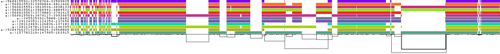
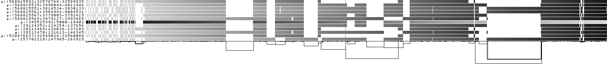
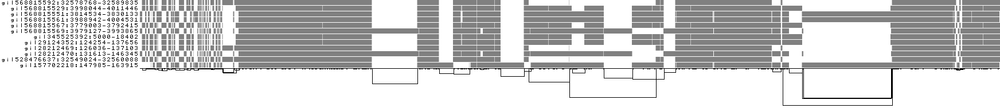
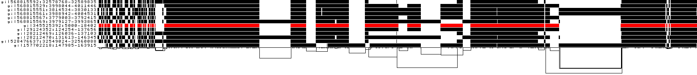
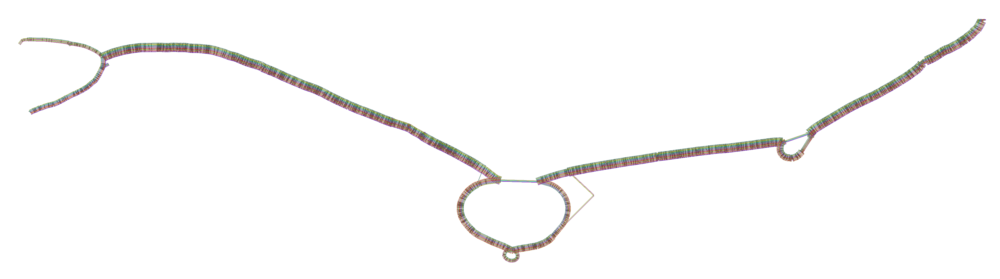

# Test data sets: `pangenome`

This branch contains test data to be used for automated testing with the nf-core/pangenome pipeline.

## Content of this repository

`data/`: FASTA files for minimal test data set.

## Minimal test data set origin


_DRB1-3123.fa.gz_ FASTA data set consists of twelve HLA DRB1-3123 haplotypes taking from [`pggb`](https://github.com/pangenome/pggb)'s example [data](https://github.com/pangenome/pggb/blob/master/data/HLA/DRB1-3123.fa.gz).

### Sequence information

| Sequence   | Length    |
|-------------|------------|
| gi\|568815592:32578768-32589835 | 11068 |
| gi\|568815529:3998044-4011446 | 13403 |
| gi\|568815551:3814534-3830133 | 15600 |
| gi\|568815561:3988942-4004531 | 15590 |
| gi\|568815567:3779003-3792415 | 13413 |
| gi\|568815569:3979127-3993865 | 14739 |
| gi\|345525392:5000-18402 | 13403 |
| gi\|29124352:124254-137656 | 13403 |
| gi\|28212469:126036-137103 | 11068 |
| gi\|28212470:131613-146345 | 14733 |
| gi\|528476637:32549024-32560088 | 11065 |
gi\|157702218:147985-163915 | 15931 |

### Example output

```sh
pggb -i data/HLA/DRB1-3123.fa.gz -p 70 -s 3000 -G 2000 -n 11 -t 2 -o drb1-3123
```

#### Seqwish graph statistics
| Length | Nodes | Edges | Paths |
| ----- | ----- | ----- | -----|
| 23622 | 3608 | 4913 | 12 |

#### 1D visualizations of the smoothed graph









#### 2D visualization of the smoothed graph



## Support

For further information or help, don't hesitate to get in touch on our [Slack organisation](https://nf-co.re/join/slack) (a tool for instant messaging).
