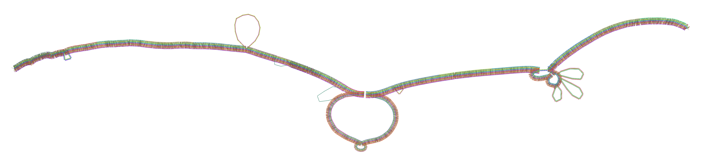

# Test data sets: `pangenome`

This branch contains test data to be used for automated testing with the nf-core/pangenome pipeline.

## Content of this repository

`data/`: FASTA files for minimal test data set.

## Minimal test data set origin

_DRB1-3123.fa.gz_ FASTA data set consists of twelve HLA DRB1-3123 haplotypes taking from [`pggb`](https://github.com/pangenome/pggb)'s example [data](https://github.com/pangenome/pggb/blob/master/data/HLA/DRB1-3123.fa.gz).

### Sequence information

| Sequence   | Lenght    |
|-------------|------------|
| gi\|568815592:32578768-32589835 | 11068 |
| gi\|568815529:3998044-4011446 | 13403 |
| gi\|568815551:3814534-3830133 | 15600 |
| gi\|568815561:3988942-4004531 | 15590 |
| gi\|568815567:3779003-3792415 | 13413 |
| gi\|568815569:3979127-3993865 | 14739 |
| gi\|345525392:5000-18402 | 13403 |
| gi\|29124352:124254-137656 | 13403 |
| gi\|28212469:126036-137103 | 11068 |
| gi\|28212470:131613-146345 | 14733 |
| gi\|528476637:32549024-32560088 | 11065 |
gi\|157702218:147985-163915 | 15931 |

### Example output

```sh
pggb -i /data/HLA/DRB1-3123.fa.gz -s 3000 -K 11 -p 70 -a 70 -n 10 -t 2 -v -l
```

#### Seqwish graph statistics
| Lenght | Nodes | Edges | Paths |
| ----- | ----- | ----- | -----|
| 23622 | 3608 | 4913 | 12 |

>Running the pipeline with the _DRB1-3123.fa.gz_ test data might result in slightly different outputs compared to what you see here. This is due to some _stochastic processes_ in [`smoothxg`](https://github.com/pangenome/smoothxg).


#### 1D visualization of the smoothed graph


#### 2D visualization of the smoothed graph


