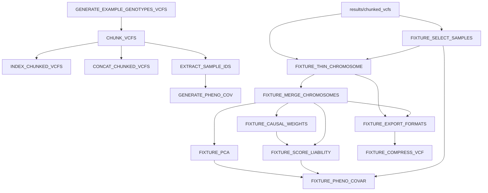

# 

Test data to be used for automated testing with the nf-core pipelines

## Introduction

This is the gwas example-data branch, part of the nf-core collection of high quality Nextflow pipelines.

## Workflow DAG

Below is a diagram of the workflow steps as a Directed Acyclic Graph (DAG):


```mermaid
graph TD
    A[GENERATE_EXAMPLE_GENOTYPES_VCFS] --> B[CHUNK_VCFS]
    B --> C[INDEX_CHUNKED_VCFS]
    B --> D[CONCAT_CHUNKED_VCFS]
    B --> F[EXTRACT_SAMPLE_IDS]
    F --> G[GENERATE_PHENO_COV]
    H[results/chunked_vcfs] --> I[FIXTURE_SELECT_SAMPLES]
    H --> J[FIXTURE_THIN_CHROMOSOME]
    I --> J
    J --> K[FIXTURE_MERGE_CHROMOSOMES]
    K --> L[FIXTURE_PCA]
    K --> M[FIXTURE_CAUSAL_WEIGHTS]
    M --> N[FIXTURE_SCORE_LIABILITY]
    K --> N
    L --> O[FIXTURE_PHENO_COVAR]
    N --> O
    I --> O
    J --> P[FIXTURE_EXPORT_FORMATS]
    K --> P
    P --> Q[FIXTURE_COMPRESS_VCF]
```

The two stages are independent. The upper stage downloads the 1000 Genomes release
and chunks it; its output is already committed, so it is skipped with
`--skip_source_generation`. The lower stage derives the GWAS pipeline fixtures from
that committed output and never touches the network.

## Git clone the gwas pipeline test data

If you want to get a local copy of the test data, you can either git clone the whole test data material, including all test data for all nf-core pipelnies, or if you want to save storage space you can clone the example data for one specific pipeline.

The data in this example-data branch is the same as the gwas pipeline uses for testing. It is accessed simply by cloning the branch either directly from nf-core if you just want to access the data, or if you want to update the data and make pull-request, it is suggested that you first fork the repository and then clone from your personal fork.

```
# If you are a normal user that wants to get a local copy of the test data
git clone -b gwas --single-branch git@github.com:nf-core/test-datasets.git

# If you are a developer and want to update the test data, fork first and then
#  use this command, substituting with your github username
git clone -b gwas --single-branch git@github.com:USERNAME/test-datasets.git

```

## Documentation

This test data comes from the 1000 Genomes Project phase3 release of variant calls. VCF files have been 'chunked' to include only the first 4,500 variants to reduce file sizes. Chromosome Y is excluded. Please see the datasets [README](https://ftp.1000genomes.ebi.ac.uk/vol1/ftp/release/20130502/README_phase3_callset_20150220) for more details. Covariates and phenotypes were randomly generated for each sample in the VCF.

nf-core/test-datasets comes with documentation in the `docs/` directory and the data can be generated running main.nf.

## Example data organisation

nf-core/test-datasets generated test data is located in the `results/` directory and includes the following structure.

```
results/
├── chunked_vcfs/
│   ├── chr1_chunked.vcf.gz
│   ├── chr1_chunked.vcf.gz.tbi
│   ├── chr2_chunked.vcf.gz
│   ├── chr2_chunked.vcf.gz.tbi
│   ├── ...
│   ├── chrX_chunked.vcf.gz
│   ├── chrX_chunked.vcf.gz.tbi
│   ├── combined_chunked.vcf.gz
│   └── combined_chunked.vcf.gz.tbi
├── pheno_cov/
│   ├── example.pheno
│   └── example.covar
├── fixtures/
│   ├── README.md
│   ├── genotypes/
│   │   ├── example_chr1.{pgen,pvar,psam,bed,bim,fam,vcf.gz,vcf.gz.tbi}
│   │   ├── example_chr2.{...}
│   │   ├── ...                     (one bundle per autosome, chr1..chr22)
│   │   ├── example_chr22.{...}
│   │   └── example_all.{...}
│   └── pheno_cov/
│       ├── example.pheno
│       ├── example.covar
│       ├── example.qcovar
│       ├── example.catcovar
│       ├── causal_weights.tsv
│       ├── fixture_samples.tsv
│       ├── fixture_sex.tsv
│       └── fixture_summary.txt

```

Each chromosome-specific VCF file (chr\*.vcf.gz) is accompanied by its corresponding tabix index (.vcf.gz.tbi), enabling efficient querying. A combined VCF and index are also included for downstream association tests or visualization.

`results/fixtures/` holds the pipeline-level GWAS fixtures: 500 samples across all 22 autosomes, 4942 LD-thinned variants (`--indep-pairwise 100 10 0.2`), the same samples and variants in PLINK 2, PLINK 1 and VCF encodings, a headered phenotype file with a simulated signal-bearing quantitative trait and a simulated binary trait, and headered covariate files carrying sex, age and principal components. They are derived from `results/chunked_vcfs/` with no download step. See [`results/fixtures/README.md`](results/fixtures/README.md) for the dimensions, how the traits were simulated, and how to regenerate them.

## Support

For further information or help, don't hesitate to get in touch on our [Slack organisation](https://nf-co.re/join/slack) (a tool for instant messaging).
