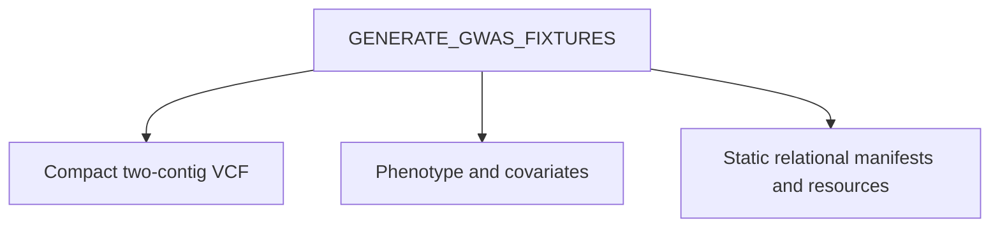

# 

Test data to be used for automated testing with the nf-core pipelines.

## Introduction

This is the `gwas` example-data branch, part of the nf-core collection of high-quality Nextflow pipeline test data.

The branch publishes one compact, deterministic fixture family. Its single BGZF VCF contains two autosomal contigs, chromosomes 1 and 2, so consumers can test multi-chromosome behavior without maintaining per-chromosome copies or additional genotype representations.

## Workflow


```mermaid
graph TD
    A[GENERATE_GWAS_FIXTURES] --> B[Compact two-contig VCF]
    A --> C[Phenotype and covariates]
    A --> D[Static relational manifests and resources]
```

The generator is network-free and uses only its declared container plus Python's standard library.

## Clone the GWAS test data

Clone the branch directly to obtain only this pipeline's test data:

```bash
git clone -b gwas --single-branch git@github.com:nf-core/test-datasets.git
```

To contribute changes, fork the repository first and substitute your GitHub username:

```bash
git clone -b gwas --single-branch git@github.com:USERNAME/test-datasets.git
```

## Fixture contract

The committed output family is:

```text
results/fixtures/
├── genotypes/
│   └── example_all.vcf.gz
├── pheno_cov/
│   ├── example.catcovar
│   ├── example.pheno
│   └── example.qcovar
└── relational/
    ├── analysis_manifest_association_only.csv
    ├── analysis_manifest_binary.csv
    ├── analysis_manifest_heritability_only.csv
    ├── analysis_manifest_heterogeneous.csv
    ├── analysis_manifest_quantitative.csv
    ├── cohort_manifest.csv
    ├── method_options_heterogeneous.json
    └── resources/
        ├── gcta_grm_extract.txt
        ├── ldak_predictor_extract.txt
        └── ldak_weights.txt
```

`example_all.vcf.gz` is a GT-only BGZF VCF with 200 samples and exactly 2,200 biallelic variants: 1,100 on chromosome 1 and 1,100 on chromosome 2. Variant IDs follow `v1_0001` through `v1_1100` and `v2_0001` through `v2_1100`. The generated genotypes contain modest blockwise linkage disequilibrium.

The phenotype contains a variable quantitative trait (`QT`) and a binary trait (`BT`) with 113 controls coded as 1 and 87 cases coded as 2. The covariate sidecars provide four full-rank quantitative covariates and one balanced categorical covariate. Sample identifiers and ordering are identical in all four scientific inputs.

The static relational bundle provides directly inspectable quantitative, binary, association-only, heritability-only, and heterogeneous analysis scenarios. Its URLs use the stable public `nf-core/test-datasets:gwas` paths. The cohort manifest selects the canonical VCF; the pipeline performs any required genotype-format preparation. The selector and weight resources contain variant IDs present in that VCF.

## Regeneration and validation

The dimensions, seed, generator, semantic validator, static manifests, and resources are all tracked on this branch. Regenerate the complete 14-file family without downloading source data:

```bash
nextflow run . -profile test
```

Validate the committed scientific and relational contracts directly:

```bash
python3 bin/validate_gwas_fixtures.py \
    --vcf results/fixtures/genotypes/example_all.vcf.gz \
    --pheno results/fixtures/pheno_cov/example.pheno \
    --qcovar results/fixtures/pheno_cov/example.qcovar \
    --catcovar results/fixtures/pheno_cov/example.catcovar \
    --relational-dir results/fixtures/relational
```

The regeneration test validates the generated data and requires all 14 generated files, including BGZF compression, to be byte-identical to the committed canonical copies.

## Support

For further information or help, join the [nf-core Slack organisation](https://nf-co.re/join/slack).
