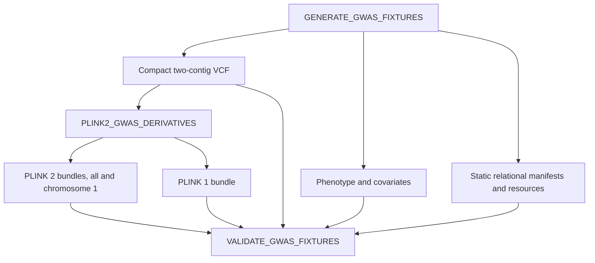

# 

Test data to be used for automated testing with the nf-core pipelines.

## Introduction

This is the `gwas` example-data branch, part of the nf-core collection of high-quality Nextflow pipeline test data.

The branch publishes one compact, deterministic fixture family. Its single BGZF VCF contains two autosomal contigs, chromosomes 1 and 2, so consumers can test multi-chromosome behavior without maintaining per-chromosome copies. Alongside it the branch publishes the PLINK 2 and PLINK 1 views derived from that VCF, so a consumer whose genotype ingress reads PLINK bundles can use the fixtures directly instead of converting them first.

## Workflow


```mermaid
graph TD
    A[GENERATE_GWAS_FIXTURES] --> B[Compact two-contig VCF]
    A --> C[Phenotype and covariates]
    A --> D[Static relational manifests and resources]
    B --> E[PLINK2_GWAS_DERIVATIVES]
    E --> F[PLINK 2 bundles, all and chromosome 1]
    E --> G[PLINK 1 bundle]
    B --> H[VALIDATE_GWAS_FIXTURES]
    C --> H
    D --> H
    F --> H
    G --> H
```

Every step is network-free and uses only its declared container: Python's standard library for the generator and validator, and PLINK 2 for the conversions.

## Clone the GWAS test data

Clone the branch directly to obtain only this pipeline's test data:

```bash
git clone -b gwas --single-branch git@github.com:nf-core/test-datasets.git
```

To contribute changes, fork the repository first and substitute your GitHub username:

```bash
git clone -b gwas --single-branch git@github.com:USERNAME/test-datasets.git
```

## Fixture contract

The committed output family is:

```text
results/fixtures/
├── genotypes/
│   ├── example_all.bed
│   ├── example_all.bim
│   ├── example_all.fam
│   ├── example_all.pgen
│   ├── example_all.psam
│   ├── example_all.pvar
│   ├── example_all.vcf.gz
│   ├── example_chr1.pgen
│   ├── example_chr1.psam
│   └── example_chr1.pvar
├── pheno_cov/
│   ├── example.catcovar
│   ├── example.pheno
│   └── example.qcovar
└── relational/
    ├── analysis_manifest_association_only.csv
    ├── analysis_manifest_binary.csv
    ├── analysis_manifest_heritability_only.csv
    ├── analysis_manifest_heterogeneous.csv
    ├── analysis_manifest_quantitative.csv
    ├── cohort_manifest.csv
    ├── method_options_heterogeneous.json
    └── resources/
        ├── gcta_grm_extract.txt
        ├── ldak_predictor_extract.txt
        └── ldak_weights.txt
```

`example_all.vcf.gz` is a GT-only BGZF VCF with 200 samples and exactly 2,200 biallelic variants: 1,100 on chromosome 1 and 1,100 on chromosome 2. Variant IDs follow `v1_0001` through `v1_1100` and `v2_0001` through `v2_1100`. The generated genotypes contain modest blockwise linkage disequilibrium. It is the source of truth from which every other genotype representation here is derived.

The PLINK derivatives are produced by PLINK v2.0.0-a.6.9, pinned through the `community.wave.seqera.io/library/plink2:2.0.0a.6.9--e6710830a4b7f0c6` container image, with exactly these three commands:

```bash
plink2 --vcf example_all.vcf.gz --double-id --make-pgen --out example_all
plink2 --vcf example_all.vcf.gz --double-id --chr 1 --make-pgen --out example_chr1
plink2 --pfile example_all --make-bed --out example_all --hard-call-threshold 0.1
```

`--double-id` makes each VCF sample ID both the family and the within-family ID. `example_chr1` is the single-contig subset for consumers testing per-chromosome behavior; it carries the same 200-sample table as `example_all`. `--hard-call-threshold 0.1` is PLINK 2's own default, stated explicitly so the PLINK 1 call is fully determined by what is written here. The pipeline step adds `--threads` and `--memory`, which bound the run and leave the output bytes unchanged. None of the three conversions writes a timestamp or any other run-specific byte into its outputs, so the committed bundles are reproducible; the per-run `.log` files are not published.

The phenotype contains a variable quantitative trait (`QT`) and a binary trait (`BT`) with 113 controls coded as 1 and 87 cases coded as 2. The covariate sidecars provide four full-rank quantitative covariates and one balanced categorical covariate. Sample identifiers and ordering are identical across the VCF, the PLINK derivatives and all three sidecars.

The static relational bundle provides directly inspectable quantitative, binary, association-only, heritability-only, and heterogeneous analysis scenarios. Its URLs use the stable public `nf-core/test-datasets:gwas` paths. The cohort manifest selects the PLINK 2 bundle, filling `pgen`, `psam` and `pvar` and leaving `bed`, `bim` and `fam` empty so exactly one representation is declared; it has no `vcf` column. The GCTA GRM selector includes all 2,200 variants so the dense GRM is estimable for 200 samples. The focused LDAK selector and weight resources contain three valid VCF variant IDs.

## Regeneration and validation

The dimensions, seed, generator, conversion commands, PLINK 2 image, semantic validator, static manifests, and resources are all tracked on this branch. Regenerate the complete 23-file family without downloading source data:

```bash
nextflow run . -profile test
```

Validate the committed scientific and relational contracts directly:

```bash
python3 bin/validate_gwas_fixtures.py \
    --vcf results/fixtures/genotypes/example_all.vcf.gz \
    --pheno results/fixtures/pheno_cov/example.pheno \
    --qcovar results/fixtures/pheno_cov/example.qcovar \
    --catcovar results/fixtures/pheno_cov/example.catcovar \
    --pgen results/fixtures/genotypes/example_all.pgen \
    --psam results/fixtures/genotypes/example_all.psam \
    --pvar results/fixtures/genotypes/example_all.pvar \
    --subset-pgen results/fixtures/genotypes/example_chr1.pgen \
    --subset-psam results/fixtures/genotypes/example_chr1.psam \
    --subset-pvar results/fixtures/genotypes/example_chr1.pvar \
    --bed results/fixtures/genotypes/example_all.bed \
    --bim results/fixtures/genotypes/example_all.bim \
    --fam results/fixtures/genotypes/example_all.fam \
    --relational-dir results/fixtures/relational
```

The validator checks the derived views against the VCF they came from: sample identity and order, variant identity, position and allele coding, PLINK 1's alternate-first `A1`/`A2` convention, and the chromosome 1 restriction of the subset.

The regeneration test validates the generated data and requires all 23 generated files, including BGZF compression and the PLINK conversions, to be byte-identical to the committed canonical copies.

## Support

For further information or help, join the [nf-core Slack organisation](https://nf-co.re/join/slack).
