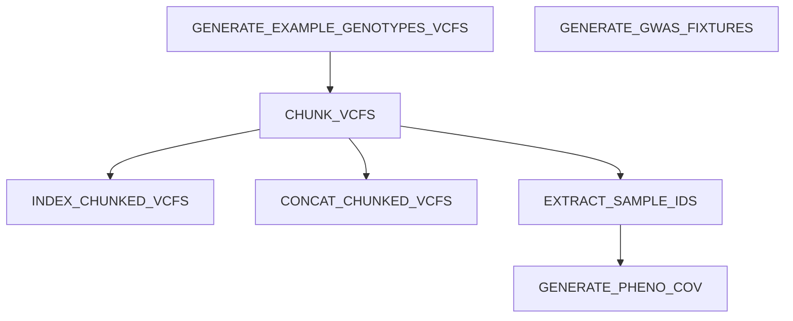

# 

Test data to be used for automated testing with the nf-core pipelines

## Introduction

This is the gwas example-data branch, part of the nf-core collection of high quality Nextflow pipelines.

## Workflow DAG

Below is a diagram of the workflow steps as a Directed Acyclic Graph (DAG):


```mermaid
graph TD
    A[GENERATE_EXAMPLE_GENOTYPES_VCFS] --> B[CHUNK_VCFS]
    B --> C[INDEX_CHUNKED_VCFS]
    B --> D[CONCAT_CHUNKED_VCFS]
    B --> F[EXTRACT_SAMPLE_IDS]
    F --> G[GENERATE_PHENO_COV]
    H[GENERATE_GWAS_FIXTURES]
```

The historical source-data stage and the compact GWAS fixture generator are
independent. The fixture generator is deterministic and does not read the network.

## Git clone the gwas pipeline test data

If you want to get a local copy of the test data, you can either git clone the whole test data material, including all test data for all nf-core pipelnies, or if you want to save storage space you can clone the example data for one specific pipeline.

The data in this example-data branch is the same as the gwas pipeline uses for testing. It is accessed simply by cloning the branch either directly from nf-core if you just want to access the data, or if you want to update the data and make pull-request, it is suggested that you first fork the repository and then clone from your personal fork.

```
# If you are a normal user that wants to get a local copy of the test data
git clone -b gwas --single-branch git@github.com:nf-core/test-datasets.git

# If you are a developer and want to update the test data, fork first and then
#  use this command, substituting with your github username
git clone -b gwas --single-branch git@github.com:USERNAME/test-datasets.git

```

## Documentation

This test data comes from the 1000 Genomes Project phase3 release of variant calls. VCF files have been 'chunked' to include only the first 4,500 variants to reduce file sizes. Chromosome Y is excluded. Please see the datasets [README](https://ftp.1000genomes.ebi.ac.uk/vol1/ftp/release/20130502/README_phase3_callset_20150220) for more details. Covariates and phenotypes were randomly generated for each sample in the VCF.

nf-core/test-datasets comes with documentation in the `docs/` directory and the data can be generated running main.nf.

## Example data organisation

nf-core/test-datasets generated test data is located in the `results/` directory and includes the following structure.

```
results/
├── chunked_vcfs/
│   ├── chr1_chunked.vcf.gz
│   ├── chr1_chunked.vcf.gz.tbi
│   ├── chr2_chunked.vcf.gz
│   ├── chr2_chunked.vcf.gz.tbi
│   ├── ...
│   ├── chrX_chunked.vcf.gz
│   ├── chrX_chunked.vcf.gz.tbi
│   ├── combined_chunked.vcf.gz
│   └── combined_chunked.vcf.gz.tbi
├── pheno_cov/
│   ├── example.pheno
│   └── example.covar
└── fixtures/
    ├── genotypes/
    │   └── example_all.vcf.gz
    └── pheno_cov/
        ├── example.pheno
        ├── example.qcovar
        └── example.catcovar

```

Each chromosome-specific VCF file (chr\*.vcf.gz) is accompanied by its corresponding tabix index (.vcf.gz.tbi), enabling efficient querying. A combined VCF and index are also included for downstream association tests or visualization.

`results/fixtures/` is a compact canonical dataset for `nf-core/gwas`. It has 200
samples and exactly 2,200 biallelic autosomal variants across chromosomes 1 and 2.
The BGZF VCF is GT-only and deliberately contains modest blockwise LD. The phenotype
file has a variable quantitative trait plus 113 controls and 87 cases. The sidecars
provide four full-rank quantitative covariates and one balanced categorical
covariate, with identical sample identifiers and order in every file.

The standard-library generator, semantic validator, dimensions, and seed are
tracked in this branch. Regenerate the four files without downloading inputs:

```bash
nextflow run . -profile test --skip_source_generation true
python3 bin/validate_gwas_fixtures.py \
    --vcf results/fixtures/genotypes/example_all.vcf.gz \
    --pheno results/fixtures/pheno_cov/example.pheno \
    --qcovar results/fixtures/pheno_cov/example.qcovar \
    --catcovar results/fixtures/pheno_cov/example.catcovar
```

The real `tests/main.nf.test` regeneration test validates the generated data and
requires all four regenerated files, including BGZF compression, to be
byte-identical to the committed canonical copies.

## Support

For further information or help, don't hesitate to get in touch on our [Slack organisation](https://nf-co.re/join/slack) (a tool for instant messaging).
